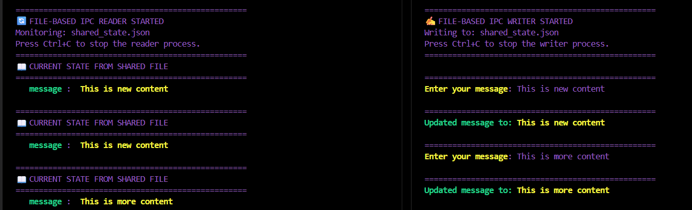

# 📝 File-Based IPC Simple Demonstration

*A simple demonstration of **file-based Inter-Process Communication (IPC)** using a shared JSON file.*

### 🛠️ Technologies Used
- **Python 3.6+**
- **Python Standard library**
- **JSON**: Structured data serialization
- **Pathlib**: Modern file path handling

## 🎓 Learning Outcomes
- **File Based Basic IPC Pattern**: State management




## 🎯 Key Concepts Demonstrated
- **Shared State** both processes access the same `ipc_state.json` file as their communication channel
- **Polling** the reader checks the file every 0.5 seconds for updates (see `sleep(5)` in reader.py).
- **JSON Serialization** data is stored in human-readable JSON format, making it easy to debug
- **Atomic Updates** the writer reads the current state before updating to avoid overwriting data

### 🪄 How it works
- **Shared State File:** `ipc_state.json`
    - processes communicate by reading and writing to this shared file
- **Reader** `reader.py`:
    - continuously reads the JSON file in a loop
    - updates the display based on the file contents
- **Writer** `writer.py`:
    - writes updates to the JSON file when user issues commands
    - the reader picks up the changes on the next read of the JSON file
- [More About How The Code Works](../Notebooks/FileBasedIPCDemoCode.ipynb)

### Architecture Overview
```
┌─────────────┐         ┌──────────────────┐         ┌─────────────┐
│   Writer    │ ──────> │  ipc_state.json  │ ──────> │   Reader    │
│  Process    │  Write  │  (Shared State)  │  Read   │  Process    │
└─────────────┘         └──────────────────┘         └─────────────┘
```

## 📝 Usage Instructions
- Install the Rich library:`pip install rich`
### Step 1: Start the Reader
- Open a terminal and navigate to the Demo1 folder and run:
    - `cd Demo1`
    - `python reader.py`
### Step 2: Start the Writer
- Open a **second terminal** (keep the reader running) and navigate to the Demo1 folder and run: 
    - `cd Demo1`
    - `python writer.py`
### Step 3: Send Messages
- In the writer terminal, type a message and press Enter:
    - `Enter your message: Hello from Demo2!`
- **The writer will:**
    - Update the JSON file with your message

### Step 4: Watch the Reader Update
- Watch the reader terminal automatically update (within 5 seconds) to display your message!
### Step 5: Stop the Processes
- Press `Ctrl+C` in either terminal to gracefully stop the processes.


# Issues
- Entire screen re-renders on update and the screen flickers


## 🔗 Related Resources
- [Inter-Process Communication Concepts](../Notebooks/InterprocessCommunication.ipynb)
- [Code Walkthrough](../Notebooks/BasicFileBasedIPC.ipynb)


**Note**: This demo is for educational purposes to understand IPC concepts. For production use, consider more robust IPC mechanisms like message queues, sockets, or dedicated IPC libraries.

