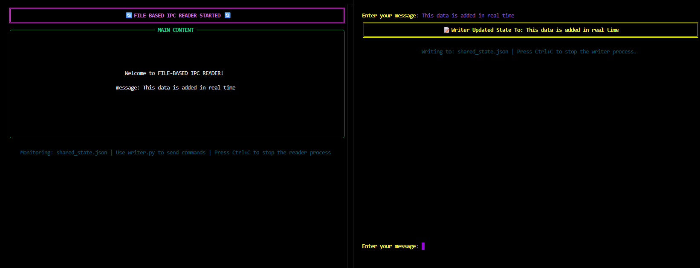

# 📝 File-Based IPC Advanced Demonstration

*An enhanced demonstration of **file-based Inter-Process Communication (IPC)** using a shared JSON file with Rich terminal UI and live updates.*


### 🛠️ Technologies Used
- **Python 3.6+**
- **Rich Library**: Terminal formatting and live displays
- **JSON**: Structured data serialization
- **Pathlib**: Modern file path handling

## 🎯 Key Concepts Demonstrated
- **Shared State** both processes access the same `ipc_state.json` file as their communication channel
- **Polling** the reader checks the file every 0.5 seconds for updates (see `sleep(5)` in reader.py).
- **JSON Serialization** data is stored in human-readable JSON format, with better state menagement because the data is more structured with content and data sections, making it easy to debug
- **Rich Terminal UI**: Beautiful formatted layouts with panels, colors, and styling
- **Live Display Updates**: the writer reads the current state before updating to avoid overwriting data, no screen flickering because it uses Rich's `Live` context manager to acheive smooth real-time updates without re-rendering entire screen(dynamic updates)
- **Modular Architecture**: Separated UI logic into `ui/layout.py` module
    - Contains all layout creation functions
    - Provides consistent styling across processes
    - Separates presentation logic from business logic
    - Makes code more maintainable and reusable
- **Enhanced Documentation**: Detailed docstrings and code comments

## 🪄 How It Works
- **Shared State File:** `ipc_state.json`
    - processes communicate by reading and writing to this shared file
- **Reader Live Display Updates**
    - the reader uses Rich's `Live` context manager to update the display without flickering
    - updates only the body section when new data arrives
    - displays formatted content in a Rich Panel
- **Writer**
    - the writer reads current state before updating to avoid data loss
    - so when the demo is stop and started again the data from the last writer is still there until it is changed
    - prompts user for input messages
    - reads current state, updates it, and writes back to file
    - updates its own layout to show the message was sent
    - uses Rich styling for visual feedback


### Architecture Overview
```
┌─────────────┐         ┌──────────────────┐         ┌─────────────┐
│   Writer    │ ──────> │  ipc_state.json  │ ──────> │   Reader    │
│  Process    │  Write  │  (Shared State)  │  Read   │  Process    │
└─────────────┘         └──────────────────┘         └─────────────┘
     │                                                        │
     │                                                        │
     └──────────> ui/layout.py <────────────────────────────┘
                 (Shared UI Components)
```


## 📝 Usage Instructions

- Install the Rich library:`pip install rich`
### Step 1: Start the Reader
- Open a terminal and navigate to the Demo2 folder:
    - `cd Demo2`
    - `python reader.py`
**You should see a beautiful formatted interface with:**
- 🔄 Header showing `FILE-BASED IPC READER STARTED`
- 📊 Body showing current content and data
- ℹ️ Footer with monitoring information

### Step 2: Start the Writer
- Open a **second terminal** (keep the reader running) and navigate to the Demo2 folder and run: 
    - `cd Demo1`
    - `python writer.py`
- **You should see:**
    - 📝 Header showing "FILE-BASED IPC WRITER STARTED"
    - 📄 Footer showing the file being written to
    - 💬 Prompt asking for your message

### Step 3: Send Messages
- In the writer terminal, type a message and press Enter:
    - `Enter your message: Hello from Demo2!`
- **The writer will:**
    - Update the JSON file with your message
    - Display confirmation with the updated header

### Step 4: Watch the Reader Update
- Watch the reader terminal automatically update (within 5 seconds) to display your message!

### Step 5: Stop the Processes
- Press `Ctrl+C` in either terminal to gracefully stop the processes.



## 🔍 Code Highlights

### Live Display (Reader)
```python
with Live(layout) as live:
    while True:
        state = load_state()
        if state:
            update_reader_content(state, layout)
        sleep(5)
```

## 🚀 Advantages Over Demo1

| Feature | Demo1 | Demo2 |
|---------|-------|-------|
| **UI Styling** | Basic print statements | Rich formatted panels |
| **Display Updates** | Screen clears/flickers | Smooth live updates |
| **Code Organization** | All in main files | Modular UI components |
| **State Structure** | Simple key-value | Nested data structure |
| **Visual Feedback** | Limited colors | Full Rich styling |
| **Maintainability** | Good for learning | Production-ready structure |

## 🎓 Learning Outcomes

By studying Demo2, you'll learn:

1. **Advanced IPC Patterns**: Structured state management for complex data
2. **Rich Library Usage**: Creating professional terminal UIs
3. **Live Display Techniques**: Updating UIs without flickering
4. **Modular Code Design**: Separating concerns for maintainability
5. **Python Best Practices**: Docstrings, type hints, and clean code

## 🔗 Related Resources

- [Rich Documentation](https://rich.readthedocs.io/)
- [Python JSON Module](https://docs.python.org/3/library/json.html)
- [Inter-Process Communication Concepts](../Notebooks/InterprocessCommunication.ipynb)
- [Code Walkthrough](../Notebooks/BasicFileBasedIPC.ipynb)

## 💡 Next Steps

Want to enhance this demo further? Try:
- Add message timestamps
- Implement message history/log
- Add file locking for concurrent safety
- Create a command system (clear, status, exit)
- Add message priorities or tags

---

**Note**: This demo is for educational purposes to understand IPC concepts. For production use, consider more robust IPC mechanisms like message queues, sockets, or dedicated IPC libraries.